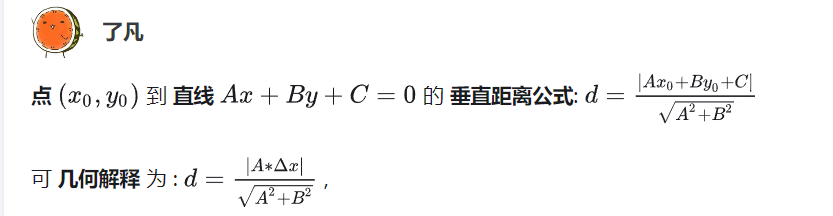

## p2LineDis

最近在做画图软件时, 遇到了`点`到`直线`的`垂直距离`问题. 经过查询和实践, 整出了下面这个函数.

```cpp
float p2LineDis(float x, float y, float x1, float y1, float x2, float y2) {
    /**
已知两点的坐标: (x1, y1); (x2, y2), 直线方程的公式: Ax + By + C = 0;
另外一个点的坐标是: (x0, y0);
求 (x0, y0) 到经过 (x1, y1); (x2, y2) 直线的距离。

A = y2 - y1,
B = x1 - x2,
C = x2 * y1 - x1 * y2;

d = |AX0 + BY0 + C| / [(A^2 + B^2)的算术平方根]

点的直线的距离公式为:
d = abs((y2 - y1) * x0 + (x1 - x2) * y0 + (x2 * y1 - x1 * y2)) / sqrt(pow(y2 - y1, 2) + pow(x1 - x2, 2));
    */
    auto a = y2 - y1;
    auto b = x1 - x2;
    auto c = x2 * y1 - x1 * y2;
    return std::abs(a * x + b * y + c) / std::hypot(a, b);
}
```

- `std::hypot(a, b)`
  对 a 的平方 加上 b 的平方, 求平方根.

## 总结

虽然顺利解决了问题, 但是总觉得不够形象, 闲时候就琢磨, `怎么把这个公式转换到几何图形`, 在某瞬间一下子就清晰了, 通过把`p1点(x1,y)`坐标转换成在`直线`上的`p2点(x2,y)`, p1 点和 p2 点的`y`坐标一样, 变数是`Δx = x2-x1`.

在知乎上找到一个对应的问题, 赶紧回答, 狠狠的秀了一把, 再编辑一遍太麻烦, 直接截图了:




