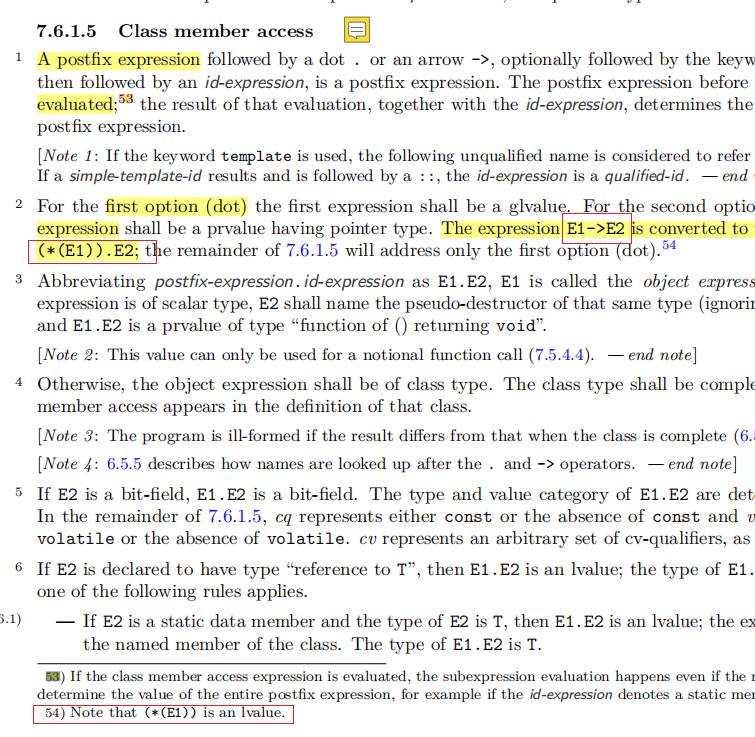

# 指针成员访问运算符

最近了解到`指针成员访问运算符`[即`->`]的知识点: `E1->E2`会转换成`(*E1).E2`, `E1`转换到`(*E1)`后, 成为一个`左值`, 下面记录了是怎么找到它的.

## 问题描述

```cpp
struct F1 {
    auto get() & {
        return "左值引用限定";
    };
    auto get() && {
        return "右值引用限定";
    };
};

F1* f1_ptr = &f1;
f1_ptr->get();  //左值引用限定
// std::move过的指针, 是右值引用, 却触发左值引用限定?
std::move(f1_ptr)->get();  //左值引用限定

```

最近发现一个问题, 是关于`非静态成员函数`添加`左值引用限定`,`右值引用限定`, 即上面的两个`get()`成员函数, `std::move(f1_ptr)->get()`, 触发了`左值引用限定`的函数.

`std::move(f1_ptr)`是`右值引用表达式`, 可用`std::is_rvalue_reference_v< decltype(std::move(f1_ptr)) >`进行验证, 直观上应该触发`右值引用限定`的函数, 有点迷惑.

**觉得是`类成员访问运算符 ->`有特殊处理**, 开始搜索研究..

## cppreference 上的成员访问运算符

看了 [成员访问运算符](https://zh.cppreference.com/w/cpp/language/operator_member_access) 解释:

> `表达式->template(可选) 标识表达式`

- 表达式 - 必须是指向完整类类型的`指针 T*`的表达式, 表达式都被求值.


这里的解释, `->`左边的表达式必须是`指针`或`指针的引用`,会被求值. `std::move(f1_ptr)`是`右值引用表达式`, 符合要求, 为啥不触发`右值引用限定`函数的原因, 还是没弄懂.

## cplusplus/draft

偶尔想到[cplusplus/draft](https://github.com/cplusplus/draft)上的`pdf`文档也有全面介绍操作符的.

果然在这里找到了答案.

在`7.6.1.5 Class member access` 看到下面的描述:



- The expression `E1->E2` is converted to the equivalent form `(*(E1)).E2` .
- 54. Note that `(*(E1))` is an lvalue.

出现在`->`左侧的表达式`std::move(f1_ptr)`, 会被求值成`(*(std::move(f1_ptr)))`, 是`左值`, 触发`左值引用限定`的函数.

`(*(std::move(f1_ptr)))`为什么是`左值`, 可以参考 [值类别](https://zh.cppreference.com/w/cpp/language/value_category)里`左值`的情形:


# 表达式值类别进行代码判断 ​

对于表达式值类别进行代码判断的方法: [模板-获取 c++表达式值类别](./模板-获取c++表达式值类别.md)
