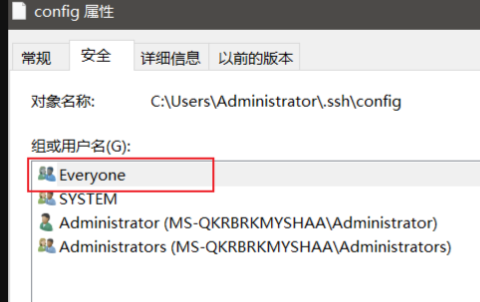

## 生成多 git 账号的密钥对

```
ssh-keygen -t ed25519 -C "Github SSH Key" -f id_ed25519_github

ssh-keygen -t ed25519 -C "Gitee SSH Key" -f id_ed25519_gitee
```

把公钥在`gitee`和`github`后台设置后, 测试下访问情况:

## ssh config 管理多账号

编辑`当前账户目录/.ssh/config`文件如下:

```
# gitee
Host gitee.com
HostName gitee.com
User git
Port 443
PreferredAuthentications publickey
IdentityFile C:/Users/superman/.ssh/id_ed25519_gitee

# github
Host github.com
HostName ssh.github.com
User git
Port 443
PreferredAuthentications publickey
IdentityFile C:/Users/superman/.ssh/id_ed25519_github
```

如下进行访问测试:

```
ssh -vT git@gitee.com

ssh -vT git@github.com

```

## windows 私钥文件权限处理

如果遇到`Bad permissions. Try removing permissions for user: \\Everyone (S-1-1-0) on file C:/Users/superman/.ssh/id_ed25519_github.`这样的报错, 需要删除`Everyone`, 对应如下图

